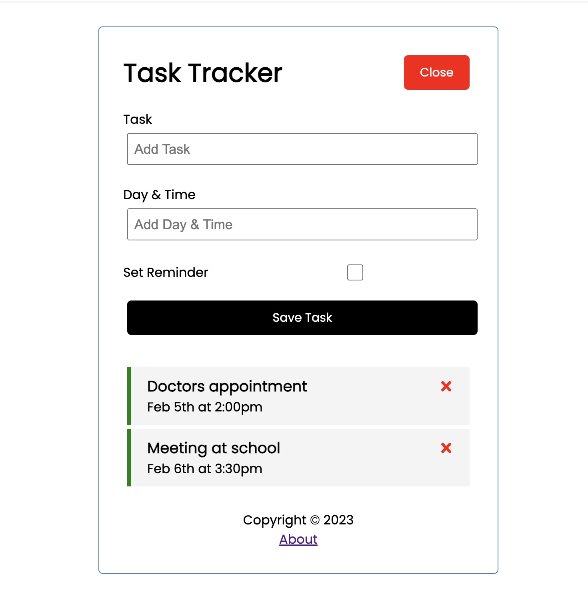

# Name of project

React-Task-Tracker

## Table of contents

- [Name of project](#name-of-project)
  - [Table of contents](#table-of-contents)
  - [General info](#general-info)
  - [Screenshots](#screenshots)
  - [Technologies](#technologies)
  - [Setup](#setup)
  - [Code Examples](#code-examples)
  - [Features](#features)
  - [Status](#status)
  - [Inspiration](#inspiration)
  - [Contact](#contact)
  - [Instructions for use](#instructions-for-use)

## General info

A straightforward CRUD project by leveraging React for the front-end and utilizing Json-server to create a RESTful API.

This project was built following [this tutorial](https://www.youtube.com/watch?v=w7ejDZ8SWv8) updated using the new react-router-dom.

React, a popular JavaScript library, served as the foundation for constructing the user interface of the application.

The project's backend was implemented using Json-server, a simple yet effective tool for generating a RESTful API based on a JSON file.

## Screenshots



## Technologies

- Node 14.16.0
- VSC code
- JavaScript
- ...
- ...

## Setup

- `npm run start`

starts the UI on port 5000

- `npm run server`

starts the backend on port 3000

## Code Examples

```js
return (
  <Router>
    <div className="container">
      <Header
        onAdd={() => setShowAddTask(!showAddTask)}
        showAdd={showAddTask}
      />
      <Routes>
        <Route
          path="/"
          element={
            // Specify the element prop here instead of using the render prop
            <>
              {showAddTask && <AddTask onAdd={addTask} />}
              {tasks.length > 0 ? (
                <Tasks
                  tasks={tasks}
                  onDelete={deleteTask}
                  onToggle={toggleReminder}
                />
              ) : (
                "no task to show"
              )}
            </>
          }
        />
        <Route path="/about" element={<About />} />
      </Routes>
      <Footer />
    </div>
  </Router>
);
```

## Features

List of features

- React UI
- Json-server backend

## Status

Project is: _done_

## Inspiration

Project by Traversy Media

## Contact

By bermarte

## Instructions for use

<details>
  <summary>Getting Started</summary>

<!-- a guide to using this repository -->

1. `git clone git@github.com:HackYourFutureBelgium/template-markdown.git`
2. `npm install`
3. `npm run start`
4. `npm run server`

</details>
